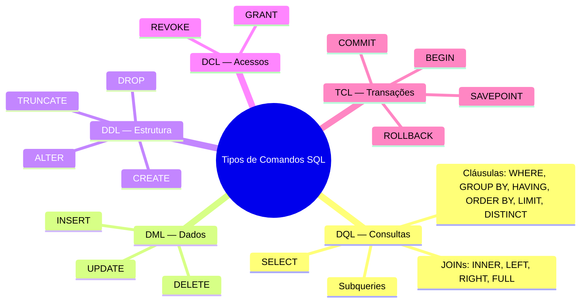

```mermaid 
mindmap
  root((Tipos de Comandos SQL))
    DQL — Consultas
      SELECT
      Cláusulas: WHERE, GROUP BY, HAVING, ORDER BY, LIMIT, DISTINCT
      JOINs: INNER, LEFT, RIGHT, FULL
      Subqueries
    DML — Dados
      INSERT
      UPDATE
      DELETE
    DDL — Estrutura
      CREATE
      ALTER
      DROP
      TRUNCATE
    DCL — Acessos
      GRANT
      REVOKE
    TCL — Transações
      BEGIN
      COMMIT
      ROLLBACK
      SAVEPOINT
```

``` mermaid
mindmap
  root((Tipos de Comandos SQL))
    DQL — Consultas
      SELECT
      Cláusulas: WHERE, GROUP BY, HAVING, ORDER BY, LIMIT, DISTINCT
      JOINs: INNER, LEFT, RIGHT, FULL
      Subqueries
    DML — Dados
      INSERT
      UPDATE
      DELETE
    DDL — Estrutura
      CREATE
      ALTER
      DROP
      TRUNCATE
    DCL — Acessos
      GRANT
      REVOKE
    TCL — Transações
      BEGIN
      COMMIT
      ROLLBACK
      SAVEPOINT
```

